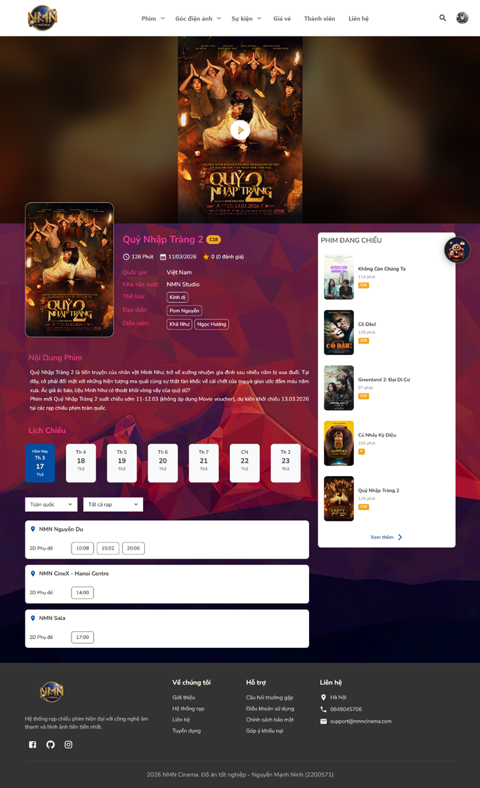

# 🎬 NMN Cinema - Phát triển hệ thống quản lý rạp chiếu phim tích hợp thanh toán trực tuyến và Chatbot AI
<p align="center">
  
</p>
<p align="center">
  <strong>Đồ án tốt nghiệp – NMN Cinema - Phát triển hệ thống quản lý rạp chiếu phim tích hợp thanh toán trực tuyến và Chatbot AI</strong>
</p>
<p align="center">
  
  
  
  
  
</p>
---
## 📖 Giới thiệu
**NMN Cinema** là hệ thống quản lý rạp chiếu phim và đặt vé xem phim trực tuyến Mern stack, được xây dựng như đồ án tốt nghiệp. Hệ thống hỗ trợ 3 vai trò chính:

- 🎥 **Khách hàng (Client):** Xem phim đang chiếu / sắp chiếu, chọn suất chiếu, chọn ghế, đặt combo bắp nước, thanh toán trực tuyến (VNPay), nhận vé QR Code, đánh giá phim, tích điểm thành viên.
- 🛡️ **Admin:** Dashboard thống kê doanh thu, quản lý phim / suất chiếu / phòng chiếu / ghế ngồi / combo / khuyến mãi / voucher / banner / bài viết / người dùng / vai trò & phân quyền.
- 📱 **Nhân viên (Staff):** Quét mã QR kiểm tra vé tại rạp.
---

## 🛠️ Tech Stack

| Layer | Công nghệ |
|---|---|
| **Frontend** | React 18, Vite, Material UI 5, Redux Toolkit, React Router 6, Socket.IO Client, Swiper, React Hook Form |
| **Backend** | Node.js, Express 4, Mongoose (MongoDB), Socket.IO, JWT, Zod Validation, Swagger API Docs |
| **Database** | MongoDB 7, Redis 7 (caching & rate limiting) |
| **Infra / DevOps** | Docker & Docker Compose, Winston Logger, Node-Cron Jobs |
| **Thanh toán** | VNPay Payment Gateway |
| **Khác** | Google OAuth 2.0, Nodemailer (email), QR Code generation, Gemini AI Chatbot, Multer (upload ảnh) |
---

## ✨ Tính năng nổi bật

- 🎟️ Đặt vé online với chọn ghế realtime (Socket.IO)
- 💳 Thanh toán qua VNPay
- 📊 Dashboard admin với biểu đồ doanh thu, thống kê suất chiếu, tỷ lệ lấp đầy ghế
- 🤖 Chatbot AI tư vấn phim (Google Gemini)
- 🔐 Phân quyền đa vai trò (Admin / Staff / User)
- 🎫 Vé điện tử QR Code
- ⭐ Đánh giá & bình luận phim
- 🏷️ Hệ thống khuyến mãi & voucher
- 🏅 Tích điểm thành viên (Membership)
- 🚀 Dockerized – deploy nhanh với 1 lệnh
---

## 📸 Screenshots

### Trang đặt vé

### Chọn ghế ngồi

---
## 🚀 Cài đặt & Chạy
### Yêu cầu
- Docker & Docker Compose
- Node.js >= 18 (nếu chạy không dùng Docker)
### Chạy với Docker (khuyến nghị)
```bash
# Clone repo
git clone https://github.com/NguyenManhNinh/NMN-CENIMA.git
cd NMN-CENIMA
# Cấu hình backend
cp backend/.env.example backend/.env
# Sửa file .env với thông tin của bạn (MongoDB URI, JWT Secret, VNPay, ...)
# Khởi chạy backend + MongoDB + Redis
cd backend
docker compose up -d
# Cài đặt & chạy frontend
cd ../frontend
npm install
npm run dev
```
Frontend mặc định chạy tại: `http://localhost:5173`
Backend API chạy tại: `http://localhost:5000`
---
## 📁 Cấu trúc thư mục
```
DATN-Cinema/
├── backend/                # REST API Server
│   ├── src/
│   │   ├── controllers/    # Xử lý request
│   │   ├── models/         # Mongoose schemas (31 models)
│   │   ├── routes/         # API endpoints
│   │   ├── services/       # Business logic
│   │   ├── middlewares/     # Auth, validation, error handling
│   │   ├── jobs/           # Cron jobs
│   │   └── utils/          # Helper functions
│   ├── docker-compose.yml
│   └── Dockerfile
│
├── frontend/               # React SPA
│   ├── src/
│   │   ├── pages/          # Admin | Client | Staff | Auth
│   │   ├── components/     # Reusable UI components
│   │   ├── redux/          # Redux Toolkit slices
│   │   ├── apis/           # Axios API calls
│   │   ├── hooks/          # Custom hooks
│   │   └── theme/          # MUI Theme config
│   └── vite.config.js
│
└── README.md
```
---
## 👨‍💻 Tác giả
**Nguyễn Mạnh Ninh** – Đồ án tốt nghiệp

