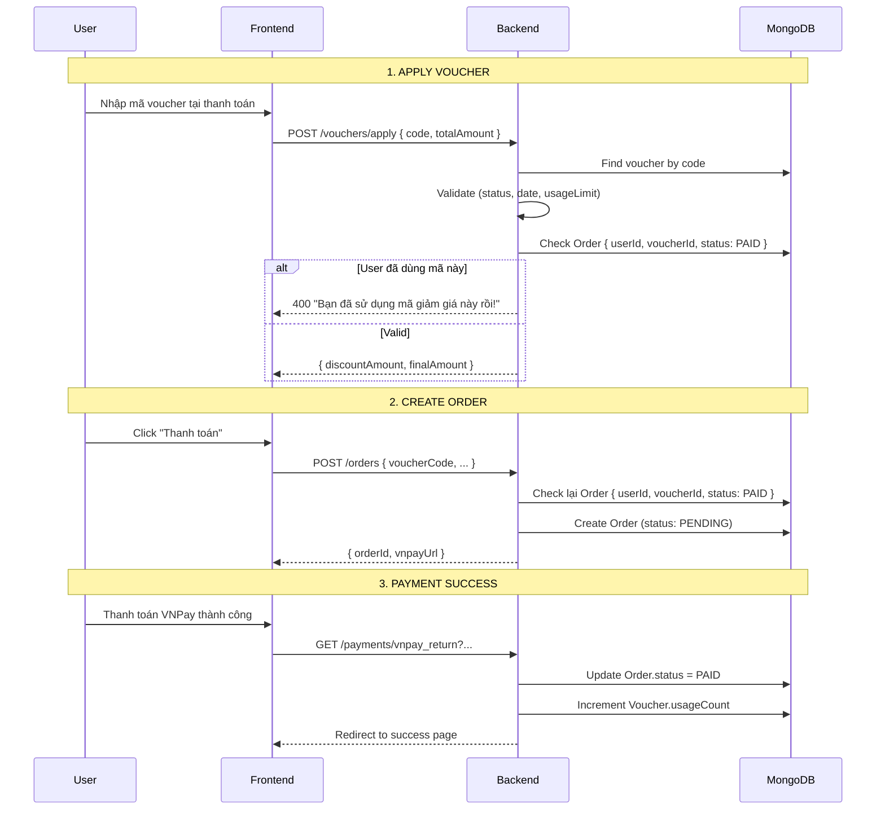

# Test Cases - Voucher Flow (Apply & One-Time Usage)

## Luồng hoạt động chính



---

## API Endpoints

| Endpoint | Method | Auth | Mô tả |
|----------|--------|------|-------|
| `/vouchers/apply` | POST | ✅ | Validate & tính discount |
| `/orders` | POST | ✅ | Tạo order với voucher |
| `/payments/vnpay_return` | GET | No | Callback từ VNPay |

---

## Test Cases

### TC01: Apply Voucher - Thành công

| Thuộc tính | Giá trị |
|------------|---------|
| **Mô tả** | User apply voucher hợp lệ lần đầu |
| **Precondition** | - User đã đăng nhập<br>- Voucher tồn tại, ACTIVE, còn hạn, còn lượt |
| **Request** | `POST /vouchers/apply { code: "GIAM20", totalAmount: 200000 }` |
| **Expected Response** | `200 { discountAmount: 40000, finalAmount: 160000 }` |
| **Status** | ⏳ |

---

### TC02: Apply Voucher - Mã không tồn tại

| Thuộc tính | Giá trị |
|------------|---------|
| **Mô tả** | Nhập mã voucher sai |
| **Request** | `POST /vouchers/apply { code: "INVALID123", totalAmount: 200000 }` |
| **Expected Response** | `404 { message: "Mã giảm giá không tồn tại!" }` |
| **Status** | ⏳ |

---

### TC03: Apply Voucher - Đã hết hạn

| Thuộc tính | Giá trị |
|------------|---------|
| **Mô tả** | Voucher quá validTo date |
| **Precondition** | Voucher có `validTo < now` |
| **Expected Response** | `400 { message: "Mã giảm giá đã hết hạn hoặc chưa có hiệu lực!" }` |
| **Status** | ⏳ |

---

### TC04: Apply Voucher - Hết lượt global

| Thuộc tính | Giá trị |
|------------|---------|
| **Mô tả** | Voucher đã dùng hết usageLimit |
| **Precondition** | `usageCount >= usageLimit` |
| **Expected Response** | `400 { message: "Mã giảm giá đã hết lượt sử dụng!" }` |
| **Status** | ⏳ |

---

### TC05: Apply Voucher - User đã dùng (One-Time)

| Thuộc tính | Giá trị |
|------------|---------|
| **Mô tả** | User cố dùng lại mã đã thanh toán thành công |
| **Precondition** | - User A đã có Order với voucherId này, status = PAID |
| **Request** | User A: `POST /vouchers/apply { code: "GIAM20", totalAmount: 200000 }` |
| **Expected Response** | `400 { message: "Bạn đã sử dụng mã giảm giá này rồi!" }` |
| **Status** | ⏳ |

---

### TC06: Apply Voucher - User khác vẫn dùng được

| Thuộc tính | Giá trị |
|------------|---------|
| **Mô tả** | User B dùng mã mà User A đã dùng |
| **Precondition** | - User A đã dùng voucher<br>- User B chưa dùng |
| **Request** | User B: `POST /vouchers/apply { code: "GIAM20", totalAmount: 200000 }` |
| **Expected Response** | `200 { discountAmount: 40000, finalAmount: 160000 }` |
| **Status** | ⏳ |

---

### TC07: Create Order với Voucher

| Thuộc tính | Giá trị |
|------------|---------|
| **Mô tả** | Tạo order với voucher đã apply |
| **Precondition** | Voucher đã được validate ở TC01 |
| **Request** | `POST /orders { voucherCode: "GIAM20", seats: [...], ... }` |
| **Expected Response** | `201 { orderId, paymentUrl }` |
| **Check DB** | Order.status = PENDING, Order.voucherId set |
| **Status** | ⏳ |

---

### TC08: Payment Success → Voucher Consumed

| Thuộc tính | Giá trị |
|------------|---------|
| **Mô tả** | Thanh toán thành công, voucher bị trừ lượt |
| **Precondition** | Order từ TC07 |
| **Action** | Complete VNPay payment |
| **Expected** | - Order.status = PAID<br>- Voucher.usageCount += 1 |
| **Status** | ⏳ |

---

### TC09: Dùng lại sau khi PAID → Block

| Thuộc tính | Giá trị |
|------------|---------|
| **Mô tả** | User cố dùng lại voucher sau khi đã PAID |
| **Precondition** | TC08 completed |
| **Request** | Same user: `POST /vouchers/apply { code: "GIAM20", totalAmount: 300000 }` |
| **Expected Response** | `400 { message: "Bạn đã sử dụng mã giảm giá này rồi!" }` |
| **Status** | ⏳ |

---

## Postman Test Collection

```bash
# TC01: Apply valid voucher
curl -X POST http://localhost:5000/api/v1/vouchers/apply \
  -H "Authorization: Bearer {token}" \
  -H "Content-Type: application/json" \
  -d '{"code": "GIAM20", "totalAmount": 200000}'

# TC05: Re-use blocked (after PAID order)
curl -X POST http://localhost:5000/api/v1/vouchers/apply \
  -H "Authorization: Bearer {same_token}" \
  -H "Content-Type: application/json" \
  -d '{"code": "GIAM20", "totalAmount": 300000}'
# Expected: 400 "Bạn đã sử dụng mã giảm giá này rồi!"
```

---

## Logic Implementation Summary

**File:** `voucherController.js` (lines 143-153)
```javascript
// Check if user already used this voucher (PAID orders only)
const usedOrder = await Order.findOne({
  userId: userId,
  voucherId: voucher._id,
  status: 'PAID'
});

if (usedOrder) {
  return next(new AppError('Bạn đã sử dụng mã giảm giá này rồi!', 400));
}
```

**Double-check in:** `orderController.js` (createOrder)
- Same check before creating order to prevent race condition
